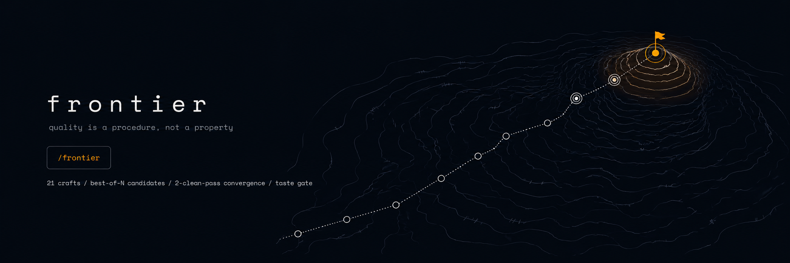
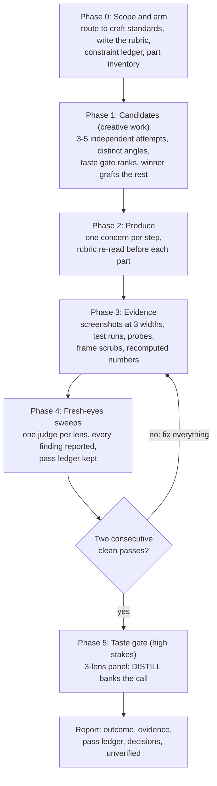

<div align="center">



# frontier

**Make Claude Opus, Sonnet, GPT, or Gemini produce work close to what Claude Fable 5 would
ship: Fable 5 itself [wrote and audited](examples/the-distillation-run.md) these 21
standards, so the model you already have executes against its bar. One response gets the
lift; the optional convergence loop and taste gate carry work that must be right.**

[](LICENSE)
[](https://docs.claude.com/en/docs/claude-code)
[](frontier/references/craft)
[](frontier/references/judges.md)
[](PROMPT.md)
[](#faq)

```
/frontier <deliverable> [quick|full|gate]
```

[Why](#quality-is-a-procedure-not-a-property) · [Output](#output-is-parseable-findings-not-vibes) ·
[One response](#it-works-in-a-single-response) · [How](#how-it-works) · [Inside](#whats-inside) ·
[Install](#install) · [Cost](#token-cost-bounded-on-purpose) · [Compared](#how-it-compares) ·
[Limits](#limitations) · [FAQ](#faq)

</div>

Before release, this system was turned on itself, and it did not pass on the first try.
[The distillation run](examples/the-distillation-run.md) is the adversarial audit of the
standards themselves; [the self-run](examples/self-run.md) publishes every gate verdict
this README received, failures first, with the fixes each one forced.

## Quality is a procedure, not a property

Ask a model to "make it great" and you get its training-data average: the same hero layout,
the same "seamlessly leverage" copy, the same confident report nobody verified.
The gap between that and frontier output is mostly not intelligence. It is method: strong
models define the standard before generating, sample several attempts instead of polishing
the first, verify against real evidence with fresh eyes, and refuse to stop at "looks done".

Method can be written down. frontier is that method, packaged: one command that runs any
task through written quality standards, independent candidate generation, evidence-grounded
verification sweeps, and a final taste judgment, until the work converges instead of merely
ending.

## Output is parseable findings, not vibes

Verifier findings arrive pinned to a location and a rubric line, in a fixed shape a script
(or a tired human) can walk (quoted from [the sample run](examples/sample-run.md)):

```
LENS: layout
FINDINGS:
1. tiers section, 768px | comparison table scannable in 15s | table forces horizontal scroll at tablet width | confidence: h
2. hero, 390x844 | claim + CTA in first viewport | CTA sits 64px below the fold on mobile | confidence: h
3. tier cards | one primary action per view | "Start free" and "Book a demo" carry equal visual weight on the Studio tier | confidence: h
CHECKED: rubric lines 1, 2, 6, 7 via screenshots at three widths, cropped
NOT CHECKABLE: line 5 (FAQ content is the copy lens)
```

The taste gate's block, from the same run:

```
GATE: fail
FINDINGS:
1. tier names | brand owner | "Starter, Growth, Studio" could be any SaaS; the product voice is trade-specific everywhere else | rename from the studio world | confidence: m
2. annual toggle | first-time audience | eye lands on the calculator, then tiers; the toggle registers on second read only | move it into the tier-card header row | confidence: h
RANKING: n/a
DISTILL:
- marketing.md candidate: pricing toggles live where the eye decides (the tier header),
  not above the section; a toggle seen after the price anchors monthly
```

An empty findings list is itself a claim: it means every rubric line was actively checked
and nothing surfaced. A full run, end to end:
[examples/sample-run.md](examples/sample-run.md). The real thing, run on this repo:
[examples/self-run.md](examples/self-run.md).

## It works in a single response

The gap-closer needs no agent and no loop. Attach the matching craft file, and the model
writes the rubric, drafts against it, then runs one fresh-eyes judge pass on its own output
and fixes what it finds, all inside one reply. Same prompt, same model, different floor: the
standards supply the taste the model would otherwise average away, and the judged pass
catches what the draft defended. [PROMPT.md](PROMPT.md) ships exactly this shape for chat
surfaces; `quick` mode is its Claude Code twin. The convergence loop below is the optional
assurance tier on top, not the price of entry.

## How it works



That diagram is `full` mode. `quick` collapses phases 1, 4, and 5 into a single judged
pass; the spine (rubric, produce, judge, fix) survives even in one response.

Three mechanisms do the heavy lifting:

| Mechanism | What it exploits |
|---|---|
| **Best-of-N candidates** | A model's best of five attempts sits far above its average attempt. Sampling the tail is where frontier-grade output lives. |
| **Fresh-eyes verification** | The context that produced work defends it; a fresh context finds what the author rationalizes. Judges only find, never fix. |
| **The taste gate + DISTILL** | Judging costs a small fraction of generating, so the strongest model available reviews everything, and every taste call it makes is converted into a permanent written rule. The system absorbs taste instead of renting it. |

The 10-minute deep dive: [docs/HOW-IT-WORKS.md](docs/HOW-IT-WORKS.md).

## What's inside

**21 craft standards**, each defining excellent in checkable numbers, with a ban list of
machine tells and a per-domain verification checklist:

| | | |
|---|---|---|
| [design](frontier/references/craft/design.md) | [motion](frontier/references/craft/motion.md) | [writing](frontier/references/craft/writing.md) |
| [code](frontier/references/craft/code.md) | [research](frontier/references/craft/research.md) | [prompting](frontier/references/craft/prompting.md) |
| [product](frontier/references/craft/product.md) | [data](frontier/references/craft/data.md) | [security](frontier/references/craft/security.md) |
| [ops](frontier/references/craft/ops.md) | [media](frontier/references/craft/media.md) | [marketing](frontier/references/craft/marketing.md) |
| [decisions](frontier/references/craft/decisions.md) | [sales](frontier/references/craft/sales.md) | [teaching](frontier/references/craft/teaching.md) |
| [management](frontier/references/craft/management.md) | [storytelling](frontier/references/craft/storytelling.md) | [academic](frontier/references/craft/academic.md) |
| [career](frontier/references/craft/career.md) | [translation](frontier/references/craft/translation.md) | [coordination](frontier/references/craft/coordination.md) |

A taste of the rules (each file carries 34 to 59 of these, counted after the last edit):

> **writing**: no three consecutive sentences within 3 words of the same length; scan for
> machine-cadence tells: claim triples ("fast, simple, and secure"), trailing participles
> ("..., making it easier than ever"), symmetric negation ("No setup. No config. Just results.")

> **design**: the primary claim and its CTA sit fully inside the first viewport at 1440x900
> AND 390x844; hairline borders are the ink color at 6-12% alpha, never default gray-200

> **data**: the classic "drop in the last week" is an incomplete week; check freshness before
> insight. A surprising number is a pipeline bug until the joins are checked.

> **decisions**: the flip test: write down what evidence would change your mind; if nothing
> would, it is not a decision, it is a commitment already made

> **code**: a test counts only if it fails when the change is reverted; a test that cannot
> fail proves nothing

Plus [the protocol](frontier/references/protocol.md) (the ten laws, weaker-model
compensations, ceiling raisers, lessons recorded from a frontier model) and
[the judges](frontier/references/judges.md) (fresh-eyes verifier, 3-lens taste gate, panel),
portable to any surface.

## The origin: standards that carry their own audit trail

The kit was authored and then adversarially audited by Claude Fable 5 (Anthropic's frontier
tier) in July 2026, in the final days of its general access: 8 auditor agents in fresh
contexts, 7 sweeping the 21 craft files and 1 reviewing the judge prompts, agents, and
skill. About 260
documented change entries came back: vague lines became numbers, rules a literal-minded
model could satisfy in letter while missing in spirit got tightened, and, most unusually,
the model wrote down its OWN tells as ban-list entries: the machine-cadence prose tics, the
default design habits, the hedge-everything analysis patterns, the fiction cliches. The
prompt review alone returned 42 findings, all applied. The full run, with its real ledgers:
[examples/the-distillation-run.md](examples/the-distillation-run.md).

The expensive model wrote the standard once; the model you already have executes against
it, session after session.

## Install

**Claude Code, as a plugin** (skills + the two judge agents):

```
/plugin marketplace add apoorvjain25/frontier
/plugin install frontier@apoorvjain25
```

**Claude Code, as a plain skill**: copy the inner [`frontier/`](frontier) folder to
`~/.claude/skills/frontier/`, and optionally [`agents/`](agents) to `~/.claude/agents/`.

**claude.ai and Cowork**: upload `frontier-skill.zip` as a custom skill (Settings,
Capabilities), or paste [PROMPT.md](PROMPT.md) plus the relevant craft file into a Project.

**Cursor, Windsurf, aider, raw API**: paste [PROMPT.md](PROMPT.md), attach the craft file
matching your domain, put your task last.

Details and troubleshooting: [docs/INSTALL.md](docs/INSTALL.md).

## Usage

| Command | What you get |
|---------|--------------|
| `/frontier the pricing page` | the default is `full`: candidates, convergence loop, taste gate, report |
| `/frontier fix the export flow quick` | rubric, produce, ONE judge pass, fixes; no loop, no gate |
| `/frontier apps/web/hero.tsx gate` | taste-judge existing work in one pass, nothing modified |
| `/frontier the launch email` | any of the 21 domains; routing is automatic |

## Token cost: bounded, on purpose

A convergence loop spends more tokens than a one-shot prompt. That is the trade:

- **Modes size the spend** (defined in Usage above): as author estimates from development
  runs, `quick` lands around 1.5-2 times a one-shot, `full` around 5-9 times, `gate` a
  single judged pass; the one measured figure sits in the [FAQ](#faq).
- **Hard cap**: 8 whole-deliverable passes; anything still open at the cap goes into the
  report for you to see.
- **Cheap judges**: verification passes cost little relative to generation, because judges
  read and report.

## How it compares

Rubrics, style guides, and self-critique are prior art; none of that is new here. What
frontier adds is the combination; the table enumerates it.

| | CLAUDE.md / Cursor rules | One-shot mega-prompt | [production-audit](https://github.com/apoorvjain25/production-audit) | frontier |
|---|---|---|---|---|
| Scope | project conventions | one task, one pass | finding what is wrong in existing products | building new work to a standard, any domain |
| Standards | prose preferences | implied by adjectives | a defect-class taxonomy | 21 domains in checkable numbers + ban lists |
| Verification | none | the model says it checked | per-finding, against the code | fresh-eyes judges against rendered evidence |
| Stop condition | n/a | the response ended | two quiet passes across its lens catalog | earned: one judged pass (quick) to two clean sweeps + gate (full) |
| Improves over time | manual edits | no | lens PRs | DISTILL: every taste call becomes a rule |
| Token cost | ~free | low | high: many sweep passes to convergence | 1.5-9x a one-shot (author estimate), mode-sized, capped |

production-audit is the sibling: it tears down what exists, frontier builds what is next,
and they share the convergence philosophy.

## Limitations

- **Not deterministic.** Two runs sample different candidates and can converge on different
  results. It raises the floor and the ceiling; it does not make output reproducible.
- **It costs real tokens.** A `full` run is a multiple of a one-shot by design. Use `quick`
  for routine work, `gate` to judge without rebuilding; the 8-pass cap bounds a `full` run.
- **The taste ceiling is the judge's ceiling.** A model judging its own tier plateaus below
  a stronger model's eye; the DISTILL flywheel narrows this over time rather than erasing
  it on day one.
- **Weaker off Claude Code.** Chat surfaces have no subagents and no screenshot or test
  tooling; judge passes run one after another in the same context, and unverifiable claims
  land in UNVERIFIED instead of being checked.
- **The standards are opinionated defaults.** They encode a specific bar (honest odd
  numbers over round vanity stats, one accent with a locked meaning, machine-cadence tells
  banned). Your brand tokens and your edits always win.

## Where things live

```
frontier/
├── SKILL.md                      # the procedure: 6 phases, modes, pass cap, report format
└── references/
    ├── protocol.md               # ten laws, compensations, ceiling raisers, frontier lessons
    ├── judges.md                 # verifier + taste gate + panel, portable and parseable
    └── craft/                    # 21 standards: numbers, ban lists, checklists
agents/
├── verifier.md                   # fresh-eyes finder (never fixes)
└── taste-judge.md                # 3-lens gate with DISTILL
docs/                             # how it works, install, customizing
examples/
├── the-distillation-run.md       # real: 8 auditors, ~260 change entries, the ledgers
├── self-run.md                   # real: this repo through its own gate
└── sample-run.md                 # illustrative: a full run, annotated
PROMPT.md                         # the whole method in one paste-able file
.claude-plugin/                   # plugin + marketplace manifests
frontier-skill.zip                # ready upload for claude.ai custom skills
```

## Make it yours

Every gate run emits DISTILL lines: taste calls converted into rule candidates; append the
ones you agree with. When the model repeats a failure the files miss, that is a one-line
ban-list entry with a replacement, and it upgrades every future run. Workflow and the rule
bar: [docs/CUSTOMIZING.md](docs/CUSTOMIZING.md) and [CONTRIBUTING.md](CONTRIBUTING.md).

## FAQ

<details>
<summary><b>Can this really get Opus, Sonnet, GPT, or Gemini close to Fable 5's output?</b></summary>

On verifiable work, that is the design: iteration and explicit standards lift a weaker
model far more than a stronger one, which is exactly the gap being closed. The ceiling is
real: a model judging its own tier plateaus below a stronger model's eye
(<a href="#limitations">Limitations</a> has the rest). The receipt:
<a href="examples/the-distillation-run.md">the distillation run</a>.
</details>

<details>
<summary><b>Is this just a big system prompt?</b></summary>

In its single-response form, honestly, it is close: an engineered rubric plus one mandatory
self-judge pass whose findings must be fixed before delivery. That judged pass is the
difference: a system prompt hopes, this one checks. On agentic surfaces it grows into a
procedure: part inventories, real evidence, parseable judges in fresh contexts, and an
earned stop you can audit. <a href="PROMPT.md">PROMPT.md</a> carries both forms.
</details>

<details>
<summary><b>What does a run cost?</b></summary>

See <a href="#token-cost-bounded-on-purpose">Token cost</a> for the mode sizing. The one
measured figure so far: the first gate pass this repo ran on its own README consumed about
64k tokens and returned 12 findings, roughly 5k tokens per defect caught before launch
(<a href="examples/self-run.md">the full pass history</a>).
</details>

<details>
<summary><b>Do I need all 21 craft files?</b></summary>

No. Phase 0 routes each task to the 1-3 files that apply (a pricing page reads design,
writing, marketing). The rest stay on disk unread. Outside Claude Code, attach just the file
matching your domain.
</details>

<details>
<summary><b>Does it work with models other than Claude?</b></summary>

The skill packaging is Claude Code native, but <a href="PROMPT.md">PROMPT.md</a> plus a
craft file runs the same procedure in Cursor, Windsurf, aider, or a raw API call to any
capable model. The standards are plain text and model-independent; only the packaging and
the tuning notes are Claude-specific.
</details>

<details>
<summary><b>What if I disagree with a rule?</b></summary>

Rules are files, and your fork is yours: edit or delete, keeping the three-part structure
(numbered rules, ban list with replacements, verification checklist). If the rule is wrong
in general, open an issue with the observed failure; that is exactly how these files grew.
</details>

<details>
<summary><b>How is this different from production-audit?</b></summary>

Same author, the same earned stop condition, opposite direction: production-audit inspects
an existing product until it stops finding defects; frontier manufactures new work so it
arrives already inspected. Run frontier to build, production-audit before you ship.
</details>

## License

MIT: run it inside a company, fork the standards to your own house rules, ship products
built under it; the only obligation is keeping the license notice. If the gate earns its
keep, a star helps the next person find it.

---

<div align="center">

*The first time it fails something you were proud of, that is the skill working.*

</div>
